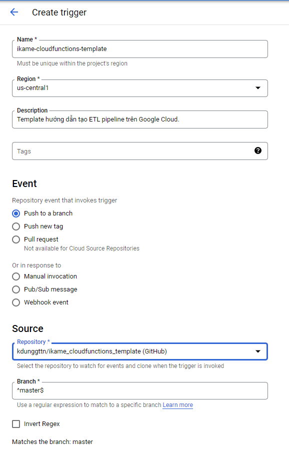
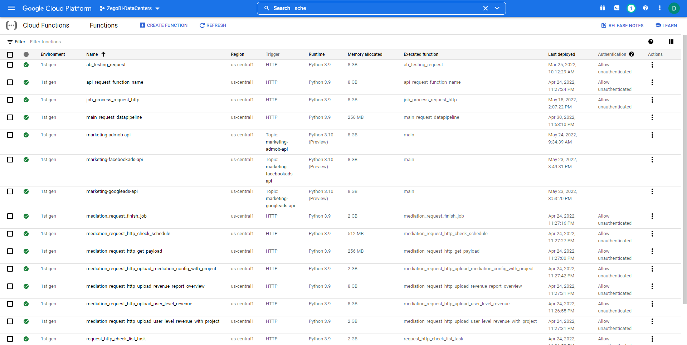

# Deploy ETL pipeline với Google Cloud Functions, Cloud Scheduler, Cloud Build và Cloud Source Repositories (Python)

## **Sơ qua các bước để deploy 1 pipeline ETL với chức năng CI/CD:**

1. Check xem project đã có đủ các keys/client_secrets chưa (các files dạng .json)
2. Viết và test code python ở local
3. Define các dependancies ở trong file requirements.txt
4. Config cấu hình cho Cloud Build ở trong file cloudbuild.yaml
5. Push repo ở local lên GitHub/Bitbucket
6. Kết nối repo ở GitHub vào Google Cloud Repositories
7. Config trigger auto build cho Repo ở trên Google Cloud Repositories, sử dụng Cloud Build
8. Config job chạy hằng ngày sử dụng Cloud Scheduler, trigger là Pub/Sub topic
9. Tạo function trên Cloud Functions, source là từ Google Cloud Repositories, trigger là Pub/Sub topic đã tạo ở bước 8

## **Hướng dẫn cụ thể:**

### 1. Check xem project đã có đủ các keys/client_secrets chưa (các files dạng .json):

* Đảm bảo rằng project đã có các file authentication phù hợp (tuỳ vào từng dự án có thể là service account hoặc client account.
* Ở trong file main.py cần trỏ đến các file json như ví dụ sau:
  ```python
  import os
  # Set environment variables
  os.environ["GOOGLE_APPLICATION_CREDENTIALS"] = "service_account_secrets.json"
  ```

### 2. Viết và test code python ở local:

```python
import something

def main(data, context):
    # Insert your code here
    # GCF yêu cầu function chính phải có param là "data" và "context" kể cả trong code không dùng. Để nguyên 2 param này.
    return 'Insert your code here'

if __name__ == "__main__":
    # Block này để test code ở local.
    main(data=None, context=None)
```

***Hãy luôn nhớ rằng code phải được đặt trong file tên "main.py" và tên function để chạy trong code phải là "main" như ví dụ trên.***

### 3. Define các dependancies ở trong file requirements.txt

```python
# Trong code dùng thư viện gì thì viết xuống dưới đây. Ví dụ:
pandas
numpy
```

### 4. Config cấu hình cho Cloud Build ở trong file cloudbuild.yaml

Trong đó, thay những giá trị sau:

* [tên_function_trên_google_cloud_functions]: Tên muốn đặt cho functions ở trên Google Cloud Functions. Tên chỉ mang tính chất phân biệt các functions với nhau (không ảnh hưởng đến code hay tính năng).
* [tên_pub_sub_topic]: Tên topic được dùng để trigger job chạy function hằng ngày. Tên này được tạo ở bước 8. Tuy nhiên nếu define luôn tên topic ở đây, thì nhớ lưu lại để ở bước 8 điền lại đúng tên này vào.

```yaml
steps:
- name: 'docker.io/library/python:3.10'
  entrypoint: /bin/sh
  args: [
    '-c',
    'ls -R',
    -c, 
    'pip3 install -r /requirements.txt'
  ]
  dir: '/'
- name: 'gcr.io/cloud-builders/gcloud'
  args: ['functions', 'deploy', '[tên_function_trên_google_cloud_functions]', '--trigger-topic=[tên_pub_sub_topic]', '--runtime=python310', '--entry-point=main']
  dir: '/'
options:
  logging: CLOUD_LOGGING_ONLY
```

### 5. Push repo ở local lên GitHub/BitBucket

Với code và các dependancies đã được set-up hoàn chỉnh, đến lúc đẩy code lên GitHub/BitBucket. Khuyến nghị nên dùng GitHub.

### 6. Kết nối repo ở GitHub vào Google Cloud Repositories

Truy cập vào: https://source.cloud.google.com/zegobi-datacenters

Danh sách các repositories đang được liên kết sẽ được hiện ra ở dưới.


Để kết nối thêm repo, click "Add repository".

Chọn "Connect external repository".


Điền thông tin như ảnh dưới:


Ấn "Continue to GitHub". Đăng nhập vào GitHub.


Chọn repo cần kết nối với Source Repositories. Click "Connect selected repository".


Vậy là đã kết nối thành công đến GitHub repo. Từ bây giờ, mọi thay đổi trên GitHub repo (push/commit) đều được mirrored vào repo của Google Cloud Repositories.

### 7. Config trigger auto build cho Repo ở trên Google Cloud Repositories, sử dụng Cloud Build

Truy cập vào: https://console.cloud.google.com/cloud-build/triggers;region=us-central1?project=zegobi-datacenters


Click "Create Trigger".

Điền thông tin như hình sau:




Chọn service account "bi-team-admin" ***(QUAN TRỌNG)***

Click "Create" để tạo trigger cho Cloud Build.

### 8. Config job chạy hằng ngày sử dụng Cloud Scheduler, trigger là Pub/Sub topic

Truy cập vào: https://console.cloud.google.com/cloudscheduler?project=zegobi-datacenters

Click "Create job".


Define the schedule
Điền các trường thông tin như sau:

* Name: Tên của Schedule. Chỉ dùng để phân biệt.
* Region: us-central1 (Iowa)
* Frequency: Để dễ set giờ, hãy vào trang: https://crontab.guru/. Ví dụ: 0 */3 * * * (Cứ 3 tiếng chạy 1 lần vào lúc 00 phút, hằng ngày).
* Timezone: Indochina Time (ICT). Để set múi giờ này, hãy gõ "Vietnam".


**Configure the execution**
Điền các trường thông tin như sau:

* Target type: Pub/Sub
* Pub/Sub topic: Nếu chưa tạo từ trước, thì hãy click "Creat a topic". Điền topic ID và ấn "Create topic". Khuyến nghị đặt Topic ID trùng với tên Cloud Repositories và Cloud Build. ***Topic ID phải trùng với "[tên_pub_sub_topic]" ở trong file cloudbuild.yaml.***
* Message body: Có thể là bất cứ gì. Ví dụ: "Run ikame_cloudfunctions_template".


**Configure optional settings**
Điền các trường thông tin như sau:

* Max retry attempts: 1
* Min backoff duration: 30s

Click "Create" để tạo schedule cho function.

### 9. Tạo function trên Cloud Functions, source là từ Google Cloud Repositories, trigger là Pub/Sub topic đã tạo ở bước 8

Truy cập vào: https://console.cloud.google.com/functions/list?project=zegobi-datacenters



Click "Create function".

**Basics**
Điền các trường thông tin như sau:

* Function name: Tên function. Tên này phải trùng với tên ở trong file "cloudbuild.yaml"

**Trigger**
Điền các trường thông tin như sau:

* Trigger type: Cloud Pub/Sub.
* Select a Cloud Pub/Sub topic: Chọn topic vừa tạo ở Cloud Scheduler (bước 8). Ví dụ: "projects/zegobi-datacenters/topics/ikame-cloudfunctions-template". ***Click "Save".***


**Runtime, build, connections and security settings - RUNTIME**
Điền các trường thông tin như sau:

* Memory allocated: Tối thiểu 2GB.
* Timeout: 540 (seconds).


Click "Next".


Điền các trường thông tin như sau:

* Runtime: Có thể chọn Python 3.9 hoặc 3.10.
* Entry point: main
* Source code: Cloud Source Repository

**Cloud Source repository**
Điền các trường thông tin như sau:

* Project ID: zegobi-datacenters
* Repository: Tên của repo đã kết nối từ GitHub. Có dạng: "github_[tên tk github]_[tên repo trên github]. Ví dụ: "github_kdunggttn_ikame_cloudfunctions_template".

Click "Deploy".

---

## Vậy là bạn đã tạo thành công 1 ETL Pipeline trên Google Cloud.

### Pipeline này có tác dụng:

* Mỗi khi bạn push code/commit từ local lên GitHub thì Google Cloud Build sẽ tự động deploy lại function của bạn với code mới nhất.
* Cứ đến hẹn giờ ở trên Cloud Scheduler thì function của bạn sẽ tự chạy.

Nếu có bất kỳ thắc mắc gì hãy liên hệ với DungNK@iKame.vn.

© 2022 DungNK@iKame.vn
